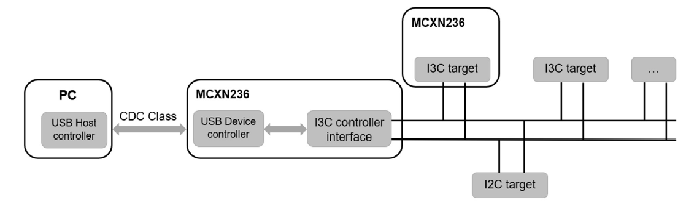
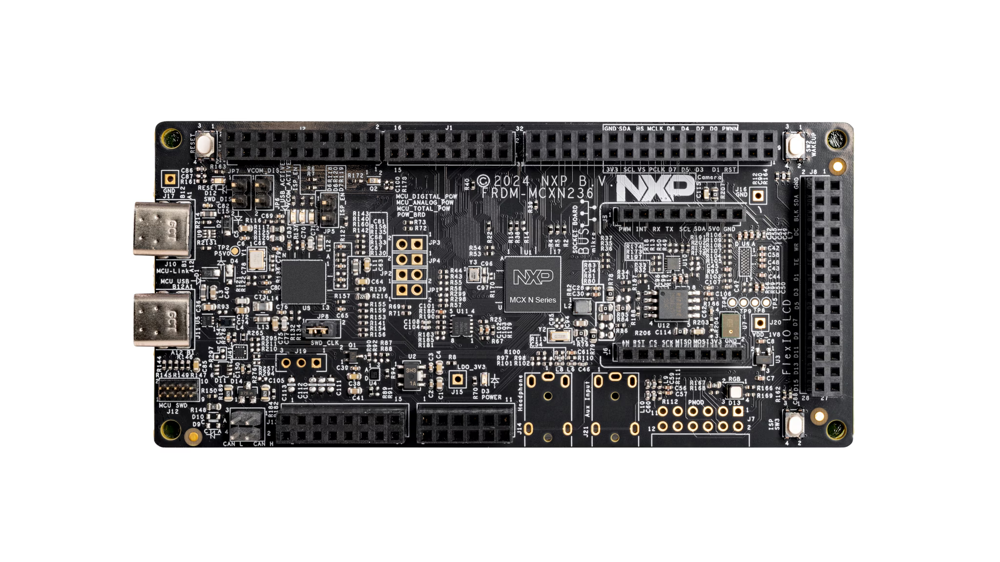
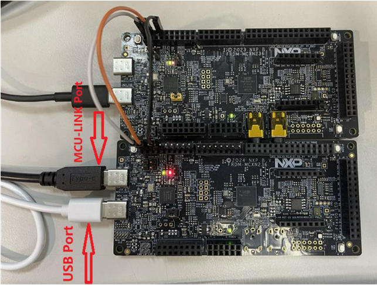
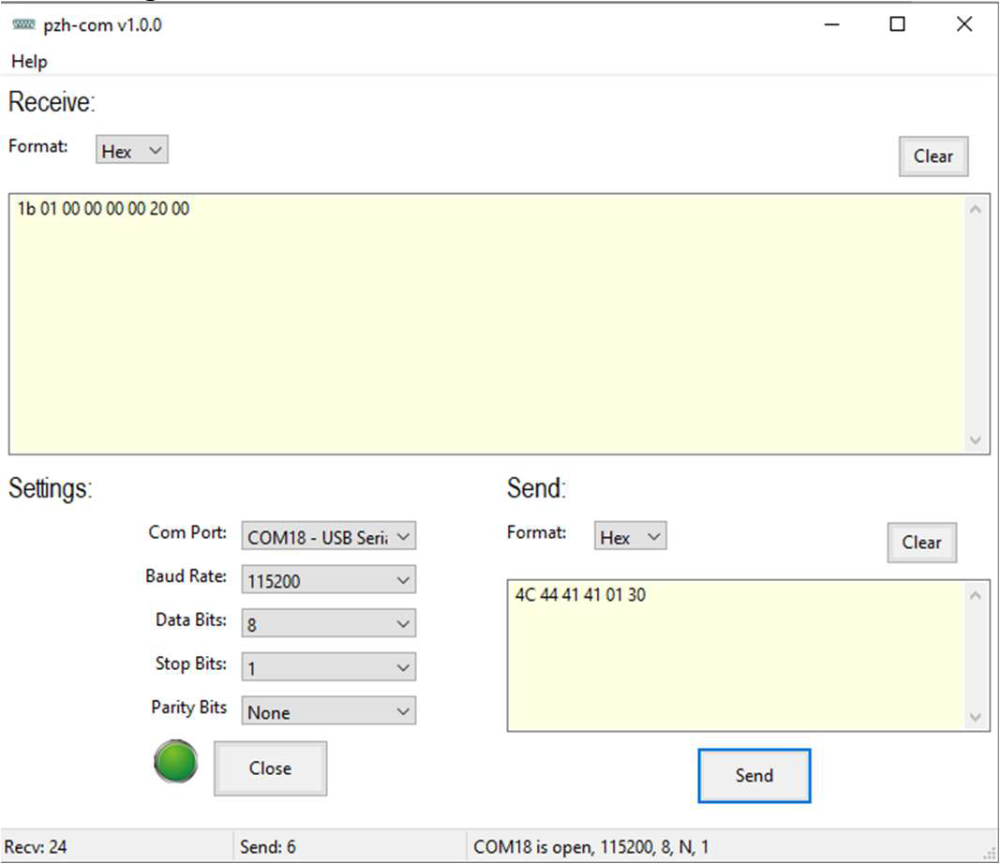
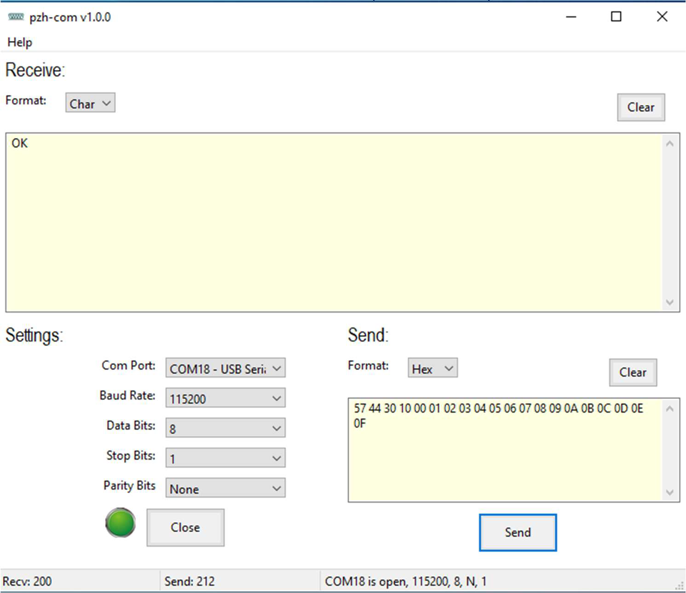
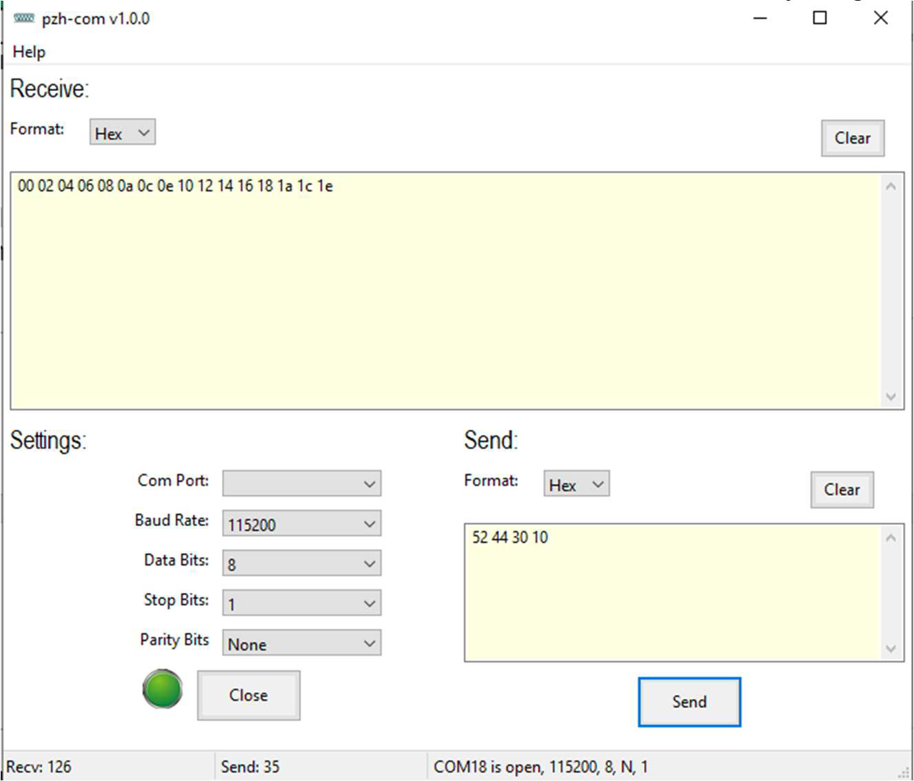

# NXP Application Code Hub

## AN14434 How to implement MCXN236 USB to I3C demo 

This is the complementary project for [AN14434](https://www.nxp.com.cn/docs/en/application-note/AN14434.pdf), which demonstrates how implement usb to i3c demo on MCXN236.  can use terminal tool to send a serial data to control I3C interface.

In the MCXN236 USB to I3C demo, the USB device uses USB CDC virtual com class to communicate with PC host. 

You can use terminal tool to send a serial data to control I3C interface.

The terminal tool used in following contents is pzh-py-com tool. Customer can download it from followed link: https://github.com/JayHeng/pzh-py-com.

This demo provided some commands such as Dynamic address assign, direct write, direct read, write with register address, read with register address, IBI/Hot-join functions.

#### Boards: FRDM-MCXN236
#### Categories: HMI
#### Peripherals: I3C, USB
#### Toolchains: MCUXpresso IDE

## Table of Contents
1. [Software](#step1)
2. [Hardware](#step2)
3. [Setup](#step3)
4. [Results](#step4)
5. [FAQs](#step5) 
6. [Support](#step6)
7. [Release Notes](#step7)

## 1. Software

The software for this Application Note is delivered in raw source files and MCUXpresso projects. Software version:

- SDK: v2.16.0
- IDE: MCUXpresso IDE v11.9.0

## 2. Hardware

- USB Type-C cable
- FRDM-MCXN236 board (https://www.nxp.com/design/design-center/development-boards-and-designs/general-purpose-mcus/frdm-development-board-for-mcx-n23x-mcus:FRDM-MCXN236)
- Personal Computer

## 3. Hardware Setup

To perform the MCXN236 USB to I3C demo, use two FRDM-MCXN236 boards one as I3C controller another was used as I3C target.

This demo uses P1_16(I3C_SDA) and P1_17(I3C_SCL) pins as i3c function. 

For hardware connection, please refer below Figure. The length of connect wires should be as short as possible.

### 3.1 Software Step

1. Open MCUXpresso IDE, in the Quick Start Panel, choose **Import from Application Code Hub**    

    

2. Enter the demo name in the search bar.   

    

3. Click **Copy GitHub link**, MCUXpresso IDE will automatically retrieve project attributes, then click **Next>**.   

    

4. Select **main** branch and then click **Next>**, Select the MCUXpresso project, click **Finish** button to complete import.   

    

5. Click **Build** to start compiling the project.

## 4. Results

Please follow the Application Note ([AN14434](https://www.nxp.com.cn/docs/en/application-note/AN14434.pdf)) to perform the USB to I3C bridge demo. You can use virtual com terminal tool to send I3C control command.

Below lists some commands.

- When the terminal send List DAA command, it will receive I3C Target information feedback which contains the target vendor ID and BCR/DCR values. 

    

- When the terminal send write without register address command. After command finished, the terminal will receive OK(0x4F, 0x4B) characters

    

- When the terminal send read without register address command. After command finished, the terminal will receive data which were sent by target.

    

- When the terminal send read with register address command. After command finished, the terminal will receive data which were sent by target.

    

## 5. FAQs

No FAQs have been identified for this project.

## 6. Support

Please open a issue for support.

#### Project Metadata

<!----- Boards ----->

<!----- Categories ----->

<!----- Peripherals ----->

<!----- Toolchains ----->

Questions regarding the content/correctness of this example can be entered as Issues within this GitHub repository.

>**Warning**: For more general technical questions regarding NXP Microcontrollers and the difference in expected functionality, enter your questions on the [NXP Community Forum](https://community.nxp.com/)

## 7. Release Notes
| Version | Description / Update                           | Date                        |
|:-------:|------------------------------------------------|----------------------------:|
| 1.0     | Initial release on Application Code Hub        | October 9th 2024 |

## Licensing

*If applicable - note software licensing here with links to licenses, otherwise remove this section*

## Origin

*if applicable - note components your application uses regarding to license terms - with authors / licenses / links to licenses, otherwise remove this section*